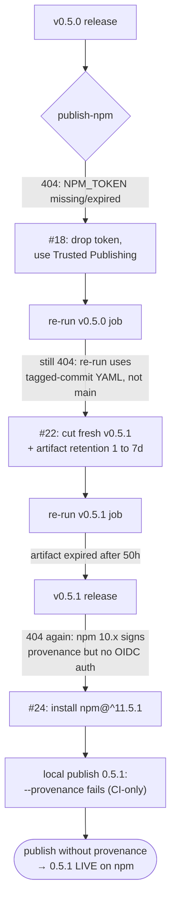

## What we built

Shipped an optional BM25 ranked-search module and got vault-tasks **0.5.1 live on
both npm and PyPI** — the latter after a four-PR debugging chain through the
release pipeline.

**Feature work (PR #15):**
- New `vault-tasks/search` subpath export — zero-dependency, in-memory BM25 over
  `title title tags body` document construction, plus a Unicode-aware tokenizer.
  Public API: `searchTasks`, `similarTasks`, `BM25Index`, `tokenize`.
- CLI: `vt search --mode bm25`, `--like <id>` (task-to-task similarity, works on
  archived tasks), `--limit N`. Default `keyword` mode is byte-identical to 0.4.x.
- `TaskStore.findIncludingArchive()` — read-only archive lookup that doesn't trip
  the modify-time guardrail.
- 359 tests passing (was 342).

**Hostile self-review of #15 (16 findings, all fixed before merge):**
- Unbounded BM25 memory → 2 MB / 100k-token document caps (a 3 MB body OOM'd a
  512 MB heap pre-fix).
- `STATUS_DISPLAY[status]` prototype-chain crash on `status: constructor` →
  `Object.hasOwn` guard.
- ANSI / newline / control-char injection via task fields → central
  `sanitizeForDisplay` at every render site.
- `--limit`/`--days` accepted `5abc`, `2.5`, `1e20` → strict
  `Number.isSafeInteger` validation.
- `SearchMode` narrowed to `'keyword' | 'bm25'` so `'semantic' | 'hybrid'` fail
  at compile time instead of runtime.
- `main().catch` printed literal `undefined` for non-Error rejections → typed
  `errorMessage()` helper.
- Keyword `--limit` sliced before priority sort (dropped high-priority matches) →
  sort-then-slice.
- Plus library/CLI default-mode alignment, tag-scope alignment, dead IDF guards
  removed.

**Release plumbing (PRs #18, #22, #24):**
- #18: switched npm publish from `NPM_TOKEN` to Trusted Publishing (OIDC).
- #22: bumped 0.5.0 → 0.5.1, artifact `retention-days` 1 → 7.
- #24: pinned `npm@^11.5.1` before the publish step (the actual fix).

## What broke / didn't work

This is the valuable part — the release took **four PRs and three failed publish
attempts** because each fix revealed the next layer.

1. **v0.5.0 npm publish failed: `404 PUT /vault-tasks`.** Misleading — npm returns
   404, not 401, for unauthenticated writes. Root cause: the `NPM_TOKEN` secret was
   missing/expired. PyPI published fine (independent Trusted Publishing). *Fixed in
   #18 by dropping the token for Trusted Publishing.*

2. **Re-running the failed v0.5.0 job didn't pick up the #18 fix.** Re-runs of
   **release-triggered** workflows use the YAML at the *tagged commit*, not current
   `main`. Confirmed by reading the attempt-2 log: it still showed
   `NODE_AUTH_TOKEN: ***`. *Worked around by cutting a fresh v0.5.1 in #22.*

3. **v0.5.1 re-run then failed on artifact download.** The build artifact had
   `retention-days: 1` and the re-run was ~50 h later → expired. *Fixed in #22 by
   bumping to 7 days.*

4. **v0.5.1 npm publish failed: `404 PUT /vault-tasks` again — but different cause.**
   Provenance signing *succeeded* (OIDC healthy, sigstore log entry present), yet the
   publish PUT went out unauthenticated. Root cause: **npm CLI version**.
   `setup-node@v6` + Node 22 ships npm 10.x; trusted-publisher *auto-detection* for
   auth landed in **npm 11.5.1**. Pre-11.5.1 signs provenance via OIDC but does NOT
   authenticate the publish via OIDC. *Fixed in #24 by installing `npm@^11.5.1`.*

5. **Local `npm publish --provenance` failed: `Automatic provenance generation not
   supported for provider: null`.** `--provenance` only works inside a recognized CI
   OIDC provider. *Worked around by publishing locally without `--provenance`* — so
   0.5.1 is the one version in the chain without a SLSA attestation.

6. **A third-party reviewer bot (`hermes-reviewer`) reviewed the wrong PR** — it
   resolved a different repo's PR #18 ("dark vibrant theme") and posted React/JSX
   findings on our YAML-only PR. Ignored as a misconfigured bot; flagged to the user.

## What I learned

- **npm returns `404 PUT` for auth failures on writes, not `401`.** By design — it
  avoids leaking package existence to unauthorized callers. So `404 Not Found` on
  publish almost always means "bad/missing credentials," not "package doesn't exist."
- **Provenance signing and publisher authentication are separate OIDC flows.** The
  CLI can sign a provenance statement via OIDC (sigstore) while still failing to
  *authenticate the publish* via OIDC. Seeing "Provenance statement published" in the
  log does NOT mean auth succeeded.
- **npm Trusted-Publishing auto-detection requires npm CLI ≥ 11.5.1** (GA 2025-07-31).
  `actions/setup-node` ships whatever npm is bundled with the chosen Node — varies by
  Node patch release, often older than 11.5.1. Pin npm explicitly for release jobs.
- **Re-running a release-triggered workflow uses the tagged commit's YAML**, not
  `main`. A workflow fix on `main` only takes effect on a *new* release event. This is
  why we couldn't recover 0.5.0/0.5.1 by re-running — each needed a new tag.
- **`--provenance` is CI-only.** Local publishes can't generate it (no OIDC provider),
  so emergency local publishes lose the attestation for that version.
- **GitHub artifacts with `retention-days: 1` are a recovery trap** — any re-run more
  than a day later fails on download. Match retention to your realistic recovery window.

## Decisions made

- **Combined recovery strategy for the stuck release:** publish 0.5.1 locally (lands
  today, no provenance) AND merge the CI fix (#24) so the *next* release publishes
  cleanly with provenance restored. Avoided burning a v0.5.2 purely on plumbing.
- **Accepted one provenance gap (0.5.1)** rather than cut yet another version. The
  package bytes are identical; only the npm "verified provenance" badge is missing for
  this one version.
- **Pinned `npm@^11.5.1`, not `@latest`** (per Qodo review) — reproducible releases,
  no surprise npm 12.x, still gets patch fixes. Logged `npm --version` for debugging.
- **Title-doubling for BM25 field weighting** instead of full BM25F — documented
  honestly as a ~1–2% length-norm distortion that's uniform across the corpus.
- **Deferred Porter stemmer** — logged as conditional task 0004; only act on it if
  recall complaints actually surface.

## Next session

- Consider pinning `npm@^11.5.1` in the **build** job too (not just `publish-npm`),
  so `npm pack` and `npm publish` use the same CLI — consistency + closes any subtle
  pack/publish drift.
