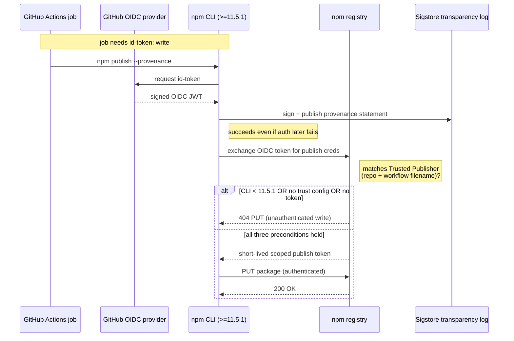

# npm Trusted Publishing from GitHub Actions

Publishing an npm package from CI via OIDC instead of a long-lived `NPM_TOKEN`.
The trust is configured once on npmjs.com and the GitHub Actions OIDC token both
**signs provenance** and **authenticates the publish**. No secret to rotate.

This note exists because getting it working end-to-end on [[vault-tasks]] took
three failed publish attempts, each with the same misleading error and a
different root cause.



## The three preconditions

All three must hold or the publish fails:

1. **npm-side trust configured** — npmjs.com → package → Settings → Trusted
   Publishers → add the org/user, repo, and **workflow filename** (e.g.
   `publish.yml`), environment left blank if the job doesn't use one.
2. **`id-token: write` permission** on the publishing job (mints the OIDC token).
3. **npm CLI ≥ 11.5.1** — the recommended minimum for trusted-publisher
   *auto-detection of OIDC authentication* (the flow reached general
   availability on 2025-07-31; the capability first shipped slightly earlier in
   the 11.5.x line). Older CLIs sign provenance but do NOT auto-authenticate the
   publish. This is the easy precondition to miss.

## The npm-CLI-version trap

`actions/setup-node` ships whatever npm is bundled with the chosen Node version —
Node 22 was still on npm 10.x. **Pre-11.5.1, the CLI signs provenance via OIDC but
does NOT authenticate the publish via OIDC.** So you see this in the log and assume
success is imminent:

```text
npm notice publish Signed provenance statement ...
npm notice publish Provenance statement published to transparency log: ...
```

...and then it fails anyway. **Provenance signing and publisher authentication are
two separate OIDC flows.** Seeing the provenance line does not mean auth worked.

Fix: pin npm before the publish step.

```yaml
- name: Upgrade npm for Trusted Publishing
  run: |
    npm install -g 'npm@^11.5.1'
    npm --version
```

Pin a range (`^11.5.1`), not `@latest` — release pipelines should be reproducible.

## The misleading 404

A failed *authenticated write* returns **`404 Not Found - PUT .../<pkg>`**, not
401. npm does this deliberately so it can't be used to probe which private packages
exist. So on a publish step, `404` almost always means **bad/missing/insufficient
credentials**, not "the package doesn't exist." Don't chase the literal message.

## `--provenance` is CI-only

`npm publish --provenance` only works inside a recognized CI OIDC provider. A local
`npm publish --provenance` errors with `Automatic provenance generation not
supported for provider: null`. An emergency local publish must drop the flag,
leaving that one version without a SLSA attestation.

## Re-runs use the tagged commit's workflow

Fixing the workflow on `main` does **not** unblock a release that already failed.
Re-running a `release`-triggered workflow uses the YAML **at the tagged commit**,
not current `main`. Recovery requires cutting a *new* tag/release, or publishing
that version by hand.

## Related

- [[vault-tasks]] — where this was learned, across PRs #18 / #22 / #24
- [[2026-06-10 0245 BM25 Search Module and npm Trusted-Publishing Saga]] — the
  session build log with the full failure chain
- PyPI Trusted Publishing follows the same OIDC model and was already working in the
  same `publish.yml` — useful as a known-good reference when debugging the npm side
